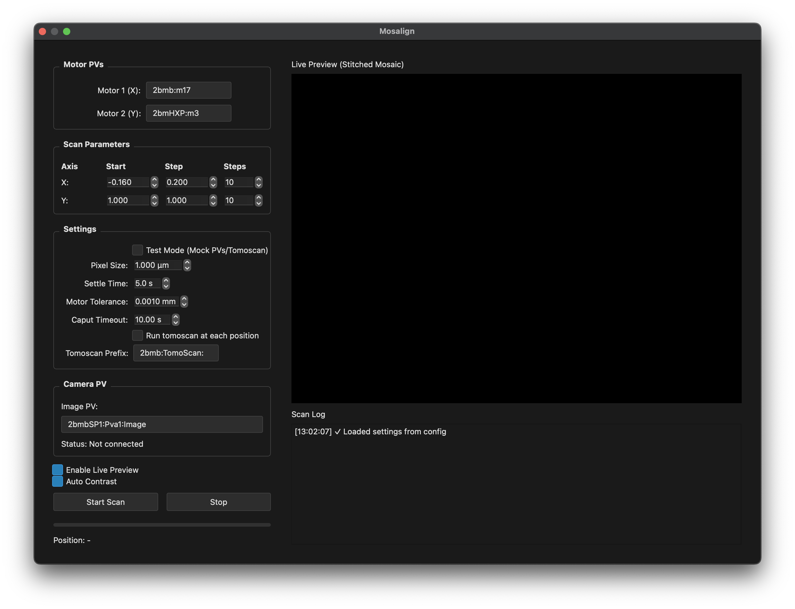

# Mosaic Alignment (Mosalign)

Automated 2D motor scanning with live stitched preview for sample alignment and mosaic imaging.





## Overview

Mosalign controls X-Y motors to scan a grid pattern while capturing images and stitching them together in real-time. Useful for:
- Large area imaging (mosaics)
- Sample positioning and alignment
- Field-of-view stitching
- Tomography sample centering

## Quick Start

```bash
mosalign
```

Or from Python:

```python
from pystream.plugins.mosalign import MotorScanDialog

dialog = MotorScanDialog()
dialog.show()
```

## Features

- **Real-time Stitching**: Live preview as scan progresses
- **Flexible Grid**: Configure X-Y scan parameters independently
- **Overlap Control**: Adjust image overlap for seamless stitching
- **PV Integration**: Direct EPICS motor control via caput
- **Tomoscan Integration**: Optional tomography acquisition at each position
- **Resume Capability**: Start from any grid position

## Configuration

### Motor PVs

Set EPICS motor process variables:
- **Motor 1 (X-axis)**: Horizontal motor PV (e.g., `2bmb:m17`)
- **Motor 2 (Y-axis)**: Vertical motor PV (e.g., `2bmHXP:m3`)

### Scan Parameters

For each axis (X and Y):
- **Start**: Initial motor position (mm)
- **Step Size**: Distance between positions (mm)
- **Steps**: Number of positions to scan

**Example:**
```
X: Start=-0.16, Step=4.0, Steps=2
Y: Start=0.0, Step=1.4, Steps=3
```
Creates a 2×3 grid (6 total positions)

### Stitching Settings

**Pixel Size**: Physical size of one pixel (µm)
- Used to convert motor steps to image pixels
- Determines stitching offset calculation

**Overlap**: Fraction of image overlap between tiles
- Range: 0-0.9 (0% to 90%)
- **Horizontal Overlap**: X-axis overlap
- **Vertical Overlap**: Y-axis overlap
- Typical: 0.10-0.20 (10-20%)

**Calculate from Step Size**: Auto-compute overlap based on:
- Motor step size
- Pixel size
- Image dimensions

### Additional Settings

**Settle Time**: Wait time after motor move (seconds)
- Allows vibrations to dampen
- Typical: 2-5 seconds

**Motor Position Tolerance**: Acceptable position error (mm)
- Stop waiting if within tolerance
- Typical: 0.001 mm

**Caput Timeout**: Maximum time for motor move command (seconds)
- Prevents indefinite hangs
- Typical: 10 seconds

**Start From Position**: Resume scan from specific grid position
- Useful if scan interrupted
- Position 1 = first tile

### Tomoscan Integration

**Run tomoscan at each position** (checkbox):
- Triggers tomography acquisition at each grid position
- Requires tomoscan CLI tool
- **Tomoscan Prefix**: IOC prefix (e.g., `2bmb:TomoScan:`)

## Operation

### Starting a Scan

1. Configure motor PVs
2. Set scan parameters
3. Adjust stitching settings
4. Optional: Enable tomoscan
5. Click **"Start Scan"**

### During Scan

- **Live Preview**: Stitched mosaic updates in real-time
- **Progress Bar**: Shows completion percentage
- **Position Display**: Current X, Y motor positions
- **Log**: Detailed scan progress messages
- **Stop Button**: Abort scan at any time

### Scan Sequence

For each position:
1. Move motors to position (X, Y)
2. Wait for settle time
3. Verify position within tolerance
4. Capture image from PV
5. Stitch into mosaic canvas
6. Optional: Run tomoscan
7. Update display

Grid scan order: X-inner loop, Y-outer loop
```
(0,0) → (1,0) → (2,0)
  ↓
(0,1) → (1,1) → (2,1)
  ↓
(0,2) → (1,2) → (2,2)
```

## Display Controls

### Image Display

**Crosshair**: Enable/disable center crosshair overlay
**Auto Level**: Reset contrast to full range
**Histogram**: Drag to adjust display levels

### View Controls

Standard PyQtGraph interactions:
- **Left-drag**: Pan image
- **Right-drag**: Zoom to region
- **Scroll wheel**: Zoom in/out
- **Right-click**: Context menu (export, etc.)

## Pixel Size Calculation

To determine pixel size:

1. **From camera specifications:**
   ```
   pixel_size = sensor_pixel_size / magnification
   ```

2. **Calibration method:**
   - Image a known scale (ruler, grid)
   - Measure pixels across known distance
   ```
   pixel_size = known_distance / pixels
   ```

## Overlap Calculation

Effective width after overlap:
```
effective_width = image_width × (1 - overlap)
```

Motor step should equal:
```
step_size = effective_width × pixel_size
```

**Example:**
- Image: 2048 pixels wide
- Pixel size: 1.3 µm
- Overlap: 15% (0.15)
- Effective width: 2048 × 0.85 = 1740.8 pixels
- Step size: 1740.8 × 1.3 = 2.263 mm

## Troubleshooting

### Motors don't move
- Check PV names are correct
- Verify EPICS IOC is running
- Test with `caput` command manually
- Check motor limits

### Image not stitching correctly
- Verify pixel size is accurate
- Check overlap values (10-20% typical)
- Ensure step sizes match calculated values
- Recalculate from step size

### Preview not updating
- Check image PV is connected
- Verify image arrives at each position
- Try clicking "Auto Level"
- Check log for errors

### Scan too slow
- Reduce settle time (if vibrations minimal)
- Decrease motor tolerance (if acceptable)
- Disable tomoscan (if not needed)

### Position errors
- Increase motor tolerance slightly
- Check for motor backlash
- Verify motor feedback working
- Increase settle time

## Python API

```python
from pystream.plugins.mosalign import MotorScanDialog

# Create dialog
dialog = MotorScanDialog()

# Configure motors
dialog.motor1_pv.setText("2bmb:m17")
dialog.motor2_pv.setText("2bmHXP:m3")

# Set scan parameters
dialog.x_start.setValue(-5.0)
dialog.x_step.setValue(2.0)
dialog.x_step_size.setValue(3)

dialog.y_start.setValue(0.0)
dialog.y_step.setValue(1.5)
dialog.y_step_size.setValue(2)

# Set stitching
dialog.pixel_size.setValue(1.3)
dialog.h_overlap.setValue(0.15)
dialog.v_overlap.setValue(0.15)

# Start scan programmatically
dialog._start_scan()

dialog.show()
```

## Use Cases

### Large Area Imaging
Scan a grid larger than single field-of-view to create mosaic.

### Sample Positioning
Scan area to locate sample features for centering.

### Tomography Alignment
Find optimal sample position before tomography scan.

### Quality Control
Systematically image multiple samples on a grid.

## Requirements

- EPICS base (for caput command)
- pvaccess (for image PV)
- Motor IOCs must be running
- Image PV must be available
- Optional: tomoscan CLI tool
