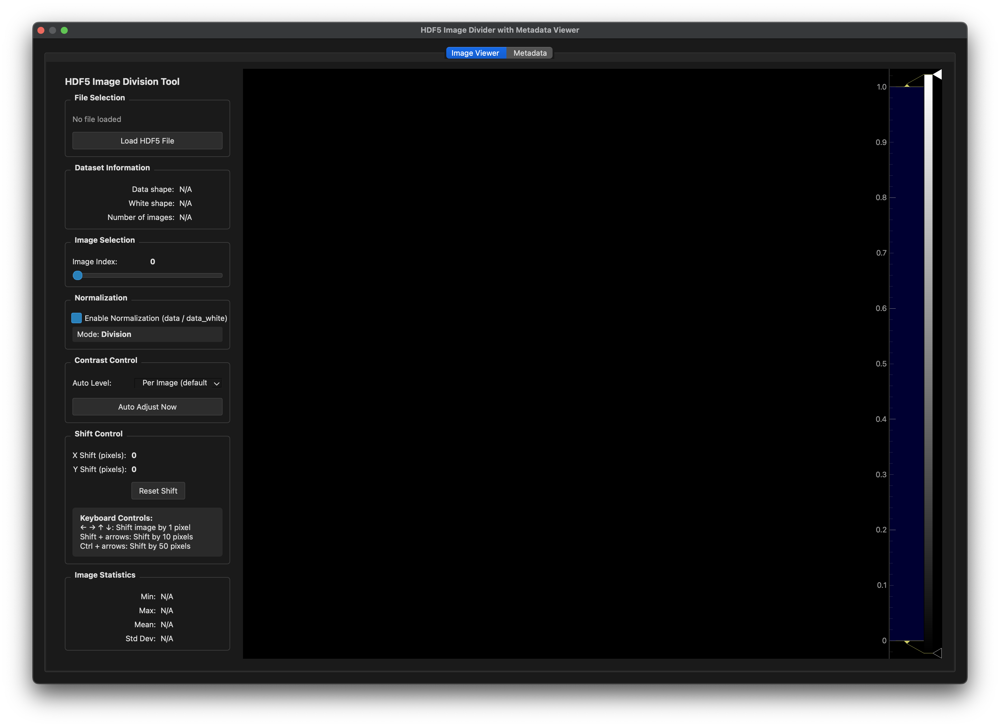

# HDF5 Image Viewer

Interactive viewer for HDF5 image data with flat-field correction.

## Quick Start

```bash
viewer
```




## Usage

### Load File
Click "Load HDF5 File" and select a file with:
- `/exchange/data` - Raw images
- `/exchange/data_white` - White field images

### Controls

**Image Selection**
- Slider: Navigate through images

**Normalization**
- Checkbox: Enable/disable division (data / data_white)

**Contrast**
- Dropdown: Select auto-level mode
  - Per Image (default)
  - Min/Max
  - Percentile 1-99%, 2-98%, 5-95%
  - Manual

**Shift (normalization mode only)**
- Arrow keys: Shift by 1 pixel
- Shift + arrows: Shift by 10 pixels
- Ctrl + arrows: Shift by 50 pixels

## Metadata

In the second data the meta data extracted from the HDF5 can be accessed.

### Example Workflow

1. Load HDF5 file
2. Enable normalization
3. Select "Percentile 2-98%" for contrast
4. Use arrow keys to align images
5. Navigate through stack with slider

## Python API

```python
from pystream.plugins.viewer import HDF5ViewerDialog
from PyQt5 import QtWidgets

app = QtWidgets.QApplication([])
dialog = HDF5ViewerDialog()
dialog.show()
app.exec_()
```
