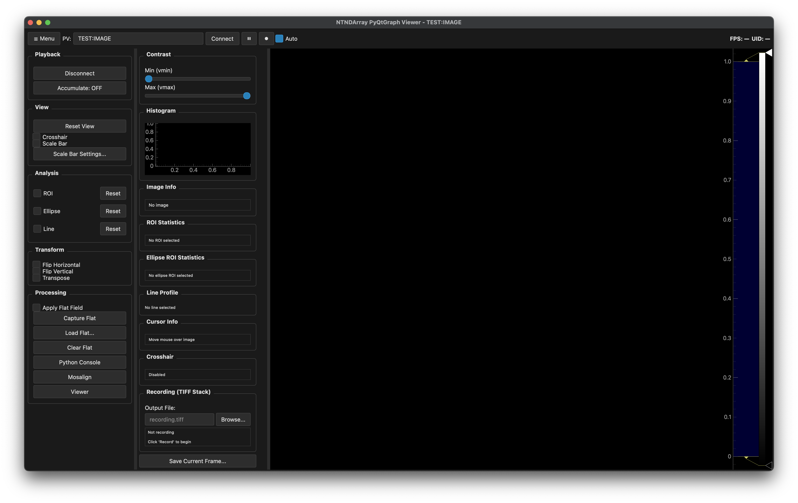

# Pystream

High-performance viewer for **EPICS PVAccess NTNDArray** data with **PyQtGraph** rendering (SSH-compatible).  
Includes interactive crosshair, recording to TIFF sequences, flat-field correction, and plugin-based processing pipeline.

---

## Installation

### 1. Create Conda Environment
```bash
conda create -n pystream python=3.10 numpy pyqt -c conda-forge
conda activate pystream
pip install pvapy pyqtgraph Pillow
conda install h5py
```


### 2. Install Package


## Install from source

```bash
git clone https://github.com/mittoalb/pystream.git
cd pystream
pip install -e .
```

### 3. Enable QScintilla Syntax Editor

If your viewer uses the syntax editor (`PyQt5.Qsci`), install **QScintilla** that matches your PyQt version:

### 4.

In case you get the following error:

```bash
qt.qpa.plugin: Could not find the Qt platform plugin "xcb" in ""
This application failed to start because no Qt platform plugin could be initialized. Reinstalling the application may fix this problem.
```
Ensure your QT_QPA_PLATFORM_PLUGIN_PATH is properly set. As an example:

```bash
export QT_QPA_PLATFORM_PLUGIN_PATH=/home/beams/USERTXM/conda/anaconda/envs/pystream/plugins/platforms
```

#### Recommended (Conda)
```bash
conda install -c conda-forge "pyqt<6" qscintilla2
```

#### Alternative (pip)
```bash
pip install QScintilla
```

If you see  
`ModuleNotFoundError: No module named 'PyQt5.Qsci'`,  
follow the conda-forge method above — pip wheels often miss the binary bindings on macOS and Linux.

---


### 4. Display troubleshooting

In case you get the following error:

```bash
qt.qpa.plugin: Could not find the Qt platform plugin "xcb" in ""
This application failed to start because no Qt platform plugin could be initialized. Reinstalling the application may fix this problem.
```
Ensure your QT_QPA_PLATFORM_PLUGIN_PATH is properly set. As an example:

```bash
export QT_QPA_PLATFORM_PLUGIN_PATH=/home/beams/USERTXM/conda/anaconda/envs/pystream/plugins/platforms
```


## Usage

```bash
# Basic
pystream --pv YOUR:NTNDARRAY:PV

# With options
pystream --pv 2bmSP2:Pva1:Image --max-fps 0 --log-level DEBUG
```



---

### Command-Line Options

| Option | Description | Default |
| ------- | ------------ | ------- |
| `--pv` | NTNDArray PV name | none |
| `--max-fps` | Max display FPS (0 = unlimited) | 0 |
| `--display-bin` | Decimation factor (0 = auto) | 0 |
| `--proc-config` | Plugin pipeline JSON path | pipelines/processors.json |
| `--no-plugins` | Disable plugin processing | off |
| `--log-level` | DEBUG/INFO/WARNING/ERROR | INFO |
| `--log-file` | Log file path | none |

---

## Features

### Interactive Crosshair
1. Check **“Crosshair”** in the toolbar  
2. Click or drag on the image  
3. X, Y position and pixel value displayed in the left panel  

### Recording
1. Choose output directory  
2. Set filename prefix (default: `frame`)  
3. Click **Start Recording** → frames saved as `prefix_000001.tiff`, `prefix_000002.tiff`, …  
4. Click **Stop Recording** to end  

### Flat-Field Correction
- **Capture**: save current frame as flat reference  
- **Apply Flat**: toggle correction on/off  
- **Load / Save**: import/export `.npy`  
- Formula: `I_norm = (I_raw / I_flat) * mean(I_flat)`

### Image Controls
- Flip H/V, Transpose  
- Manual or auto contrast  
- Pause / Resume streaming  
- Save single frame (`.npy`, `.png`)  

---

## Plugin Pipeline

Plugins process each frame before display.

**Example `pipelines/processors.json`:**
```json
{
  "processors": [
    {
      "name": "MedianFilter",
      "module": "processors.filters",
      "class": "MedianFilter",
      "kwargs": {"kernel_size": 3}
    },
    {
      "name": "BackgroundSubtract",
      "module": "processors.background",
      "class": "BackgroundSubtract",
      "kwargs": {"method": "rolling", "window": 10}
    }
  ]
}
```

**Example `processors/myfilter.py`:**
```python
import numpy as np

class MyFilter:
    def __init__(self, **kwargs):
        self.param = kwargs.get("param", 1.0)

    def apply(self, img: np.ndarray, meta: dict) -> np.ndarray:
        # meta includes keys like {"uid": frame_id, "timestamp": ts}
        return img * self.param
```

---

## Configuration

Settings persist in  
`~/.pystream/viewer_config.json`  

- Stores last used PV (auto-connects next launch)

---

## Directory Structure
```
pystream/
├── src/pystream/
│   ├── pyqtgraph_viewer.py
│   ├── logger.py
│   ├── procplug.py
│   └── pipelines/
│       └── processors.json
├── processors/          # user plugins
├── pyproject.toml
└── README.md
```

---

## Requirements

- Python ≥ 3.8  
- numpy ≥ 1.21  
- PyQt5 ≥ 5.15  
- pyqtgraph ≥ 0.13.0  
- pvapy ≥ 5.6.0  
- Pillow ≥ 9.0  

---

## Troubleshooting

### 🚫 Script not found after install
```bash
hash -r
pystream --help
```

### ⚠️ `ModuleNotFoundError: No module named 'PyQt5.Qsci'`
- Ensure QScintilla is installed:  
  `conda install -c conda-forge qscintilla2`
- Remove broken pip installs:  
  `rm -rf $CONDA_PREFIX/lib/python*/site-packages/QScintilla*`
- On macOS/ARM64, prefer conda-forge (pip wheel lacks compiled library).

### 💥 `OSError: .../QScintilla-*.dist-info/METADATA not found`
- Broken wheel metadata → reinstall:  
  `pip install --ignore-installed --no-deps --force-reinstall qscintilla==2.14.1`

### 🧠 Import errors in local modules
Use **relative imports** inside `src/pystream/`, e.g.:
```python
from .logger import init_logger
```
not
```python
from logger import init_logger
```

### 🐢 Performance tuning
- Use smaller display bin: `--display-bin 2` or `--display-bin 4`
- Increase autoscale interval: `--auto-every 20`
- Disable plugins: `--no-plugins`
- Close histogram or secondary widgets if running over SSH

### 🖥 Headless / Remote sessions
If no display is present (`DISPLAY` unset), Qt uses offscreen mode:
```bash
export QT_QPA_PLATFORM=offscreen
```

---

## License
MIT
